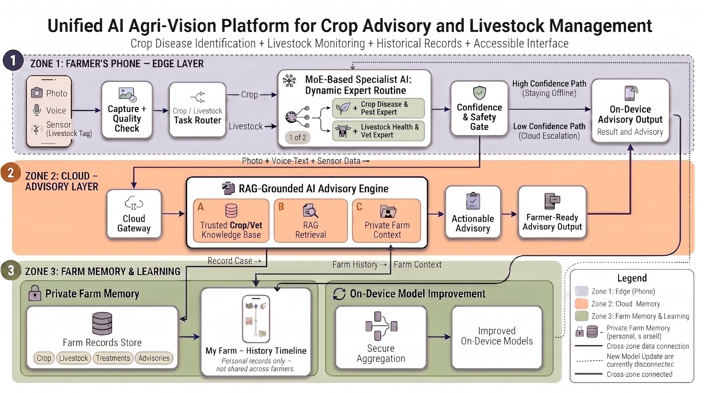

# 🌾 Unified AI Agri-Vision Platform

<div align="center">
  
  
  
  
  
</div>

<br>

**A multimodal, offline-first agricultural assistant providing specialist-grade crop disease identification and livestock health monitoring for rural farmers.**

---

## 🎯 Problem Statement
In rural agricultural regions, farmers face a critical fragmentation problem. They lack easy, unified access to both veterinary specialists for their livestock and agronomists for their crops. Existing digital solutions are highly fragmented (requiring separate apps for different domains), depend heavily on high-speed internet, and are often built entirely in English—alienating marginal farmers with lower literacy levels.

## 🔬 Analysis & Approach
We analyzed the target demographic (rural small-holding farmers) and identified three critical barriers to adoption:
1. **Connectivity:** Network conditions are poor; a cloud-only app will fail when needed most.
2. **Literacy & Language:** Text-heavy English interfaces exclude the majority of our users.
3. **App Fatigue:** Farmers will not download and manage multiple different apps for different farm problems.

## 💡 Proposed Solution
We built a **Single Unified Application** that solves all three problems:
- **One Farm, One App:** A unified interface for both Crop and Livestock health. A Mixture of Experts (MoE) router automatically detects what the farmer uploaded and routes it to the correct AI specialist.
- **Offline-First:** The platform relies on lightweight Vision Transformers and MobileNets running directly on the edge device. If the AI is highly confident, it provides an instant offline diagnosis without ever needing internet access.
- **Bilingual & Voice-First:** The entire UI is fully translated (English / Hindi). The platform accepts spoken Hindi symptom descriptions via AI4Bharat Speech-to-Text, fusing spoken evidence with visual evidence to make a highly accurate diagnosis.
- **Cloud Escalation (RAG + Gemini):** If the edge models are uncertain, the system securely escalates the case to the cloud, utilizing Retrieval-Augmented Generation (RAG) against a verified agricultural knowledge base and the Gemini Pro API.

---

## 🏗️ Proposed Architecture



*Our 3-Zone Architecture ensures rapid response times while maintaining fallback capabilities for complex anomalies.*

1. **Zone 1 (Edge AI):** Contains the auto-router, visual experts (MobileNetV2, ViT, EfficientNet-B3), and the fusion logic. Runs entirely on the local device.
2. **Zone 2 (Cloud Assist):** Triggered only when Zone 1 confidence is below 75%. Uses Gemini API and RAG to perform deep analysis on complex diseases.
3. **Zone 3 (Private Farm Memory):** A local SQLite database that acts as a continuous health record, allowing the AI to understand historical trends season-over-season.

---

## 🚀 Technologies & Libraries Used
- **Frontend / UI:** [Streamlit](https://streamlit.io/) (Bilingual Hindi/English customized interface)
- **Computer Vision:** [PyTorch](https://pytorch.org/) & [Hugging Face Transformers](https://huggingface.co/) (MobileNetV2, ViT, EfficientNet-B3)
- **Voice / Speech:** [AI4Bharat](https://ai4bharat.iitm.ac.in/) (IndicConformer ASR & IndicVITS TTS)
- **Cloud LLM & RAG:** [Google Gemini API](https://deepmind.google/technologies/gemini/) & `sentence-transformers`
- **Database:** Local SQLite (Zero-configuration edge storage)

---

## 📂 Project Structure

```text
agri-vision-platform/
├── architecture_diagram.jpeg    # High-level system architecture
├── contract.md                  # Frozen JSON data contract between Zones
├── setup/                       # Environment bootstrap and model download scripts
│   ├── setup_venv.sh             
│   ├── download_crop_model.py    
│   └── download_livestock_model.py
├── src/
│   ├── app/                     
│   │   └── streamlit_app.py     # Main UI shell (Bilingual, Edge+Cloud integrated)
│   ├── zone1_edge/              # 🟢 OFFLINE ZONE (Computer Vision & Fusion)
│   │   ├── config.py            # Global thresholds and model repo IDs
│   │   ├── experts/             # Base experts (Crop, Livestock)
│   │   ├── multimodal/          # Fusion engine (combines text, image, sensors)
│   │   ├── task_router/         # Auto-routes images to correct expert
│   │   └── pipeline.py          # Zone 1 orchestrator
│   ├── zone2_cloud/             # ☁️ CLOUD ZONE (Escalation & Voice)
│   │   ├── asr/                 # Hindi Speech-to-Text
│   │   ├── tts/                 # Hindi Text-to-Speech
│   │   ├── gemini/              # LLM integration
│   │   └── rag/                 # Knowledge base retrieval
│   └── zone3_memory/            # 📖 MEMORY ZONE (Local DB)
│       ├── db/farm_memory.py    # SQLite CRUD operations
│       └── schema/schema.sql    # Database schema for observations & diagnoses
└── tests/                       # Unit and integration test suites
```

---

## ⚙️ Setup & Installation Instructions

### 1. Environment Setup (Mac / Apple Silicon)
```bash
# Clone the repository
git clone https://github.com/Sagnik120/agri-vision-platform.git
cd agri-vision-platform

# Setup virtual environment
bash setup/setup_venv.sh
source .venv/bin/activate
```

### 2. Download Pretrained Models
*Note: Ensure you are logged into Hugging Face CLI.*
```bash
huggingface-cli login
python setup/download_crop_model.py
python setup/download_livestock_model.py
```

### 3. Run the Application
We have built a fallback "Mock" mode to bypass heavy model loading on constrained devices (like MacOS Apple Silicon without full MPS support).
```bash
# Launch the bilingual Streamlit UI
.venv/bin/streamlit run src/app/streamlit_app.py
```

---

## 🌟 Key Impact
By bringing specialist-grade diagnostics directly to low-end smartphones without requiring internet access or English fluency, this platform fundamentally democratizes agricultural extension services. It reduces livestock mortality, limits crop yield loss, and empowers marginal farmers to build a continuous, private health record of their entire farm.
