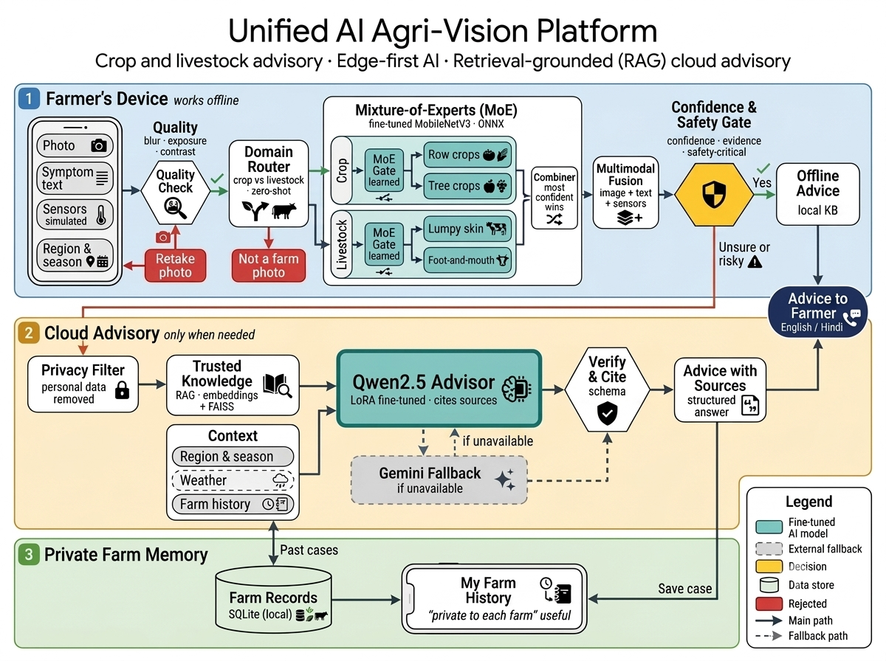

# 🌾 Unified AI Agri-Vision Platform

<div align="center">
  
  
  
  
  
</div>

<br>

**A multimodal, offline-first agricultural assistant providing specialist-grade crop disease identification and livestock health monitoring for rural farmers.**

---

## 🎯 Problem Statement
In rural agricultural regions, farmers face a critical fragmentation problem. They lack easy, unified access to both veterinary specialists for their livestock and agronomists for their crops. Existing digital solutions are highly fragmented (requiring separate apps for different domains), depend heavily on high-speed internet, and are often built entirely in English—alienating marginal farmers with lower literacy levels.

## 🔬 Analysis & Approach
We analyzed the target demographic (rural small-holding farmers) and identified three critical barriers to adoption:
1. **Connectivity:** Network conditions are poor; a cloud-only app will fail when needed most.
2. **Literacy & Language:** Text-heavy English interfaces exclude the majority of our users.
3. **App Fatigue:** Farmers will not download and manage multiple different apps for different farm problems.

## 💡 Proposed Solution
We built a **Single Unified Application** that solves all three problems:
- **One Farm, One App:** A unified interface for both Crop and Livestock health. After an image quality check, a domain router detects whether the photo shows a crop or an animal, and a learned Mixture-of-Experts (MoE) gate sends it to fine-tuned specialists (two per domain: row crops / perennial crops; lumpy skin disease / foot-and-mouth disease).
- **Offline-First:** The platform relies on lightweight fine-tuned MobileNetV3 experts (ONNX) running directly on the edge device. If the AI is highly confident, it provides an instant offline diagnosis without ever needing internet access.
- **Bilingual & Simple:** The entire UI is fully translated (English / Hindi) with a photo-first flow. The farmer's typed symptom description is fused with the visual evidence (and simulated livestock sensor readings) to make a more accurate diagnosis.
- **Cloud Escalation (RAG + fine-tuned Qwen, Gemini fallback):** If the edge models are uncertain, the case is safety-critical, or the evidence conflicts, the system escalates to the cloud. Retrieval-Augmented Generation (RAG) fetches citation-tagged documents from a verified agricultural knowledge base; a LoRA-fine-tuned Qwen2.5 model writes the structured advisory using that knowledge plus the farm's own history, region, season and weather. Google Gemini is the fallback if the Qwen service is unavailable. Every advisory is checked by a validator (schema, no drug dosages, citations must exist).

---

## 🏗️ Proposed Architecture



*Our 3-Zone Architecture ensures rapid response times while maintaining fallback capabilities for complex anomalies.*

1. **Zone 1 (Edge AI):** Image quality check, crop/livestock domain router, learned MoE gate with fine-tuned MobileNetV3 experts, multimodal fusion (text and sensor evidence), the confidence and safety gate, and the offline advisory with season/region guidance. Runs entirely on the local device.
2. **Zone 2 (Cloud Assist):** Triggered when Zone 1 is not confident enough (below 75%), the case is safety-critical, or evidence conflicts. Personal data is stripped, then RAG, the fine-tuned Qwen advisor (Gemini as fallback) and a citation validator produce the advisory.
3. **Zone 3 (Private Farm Memory):** A local SQLite database that acts as a continuous health record. Past cases are passed to the cloud advisor as citable history so advice reflects trends season-over-season. Records stay private to each farm.

---

## 🚀 Technologies & Libraries Used
- **Frontend / UI:** [Streamlit](https://streamlit.io/) (Bilingual Hindi/English customized interface)
- **Computer Vision:** [PyTorch](https://pytorch.org/) & [Hugging Face Transformers](https://huggingface.co/) (fine-tuned MobileNetV3 experts, ONNX)
- **Cloud LLM & RAG:** [Google Gemini API](https://deepmind.google/technologies/gemini/) & `sentence-transformers`
- **Database:** Local SQLite (Zero-configuration edge storage)

---

## 📂 Project Structure

```text
agri-vision-platform/
├── architecture_diagram.png     # High-level system architecture
├── instructions/                # Project instructions and contracts
│   └── contract.md              # Frozen JSON data contract between Zones
├── setup/                       # Environment bootstrap and model download scripts
│   ├── setup_venv.sh             
│   ├── download_crop_model.py    
│   └── download_livestock_model.py
├── src/
│   ├── app/                     
│   │   └── streamlit_app.py     # Main UI shell (Bilingual, Edge+Cloud integrated)
│   ├── zone1_edge/              # 🟢 OFFLINE ZONE (Computer Vision & Fusion)
│   │   ├── config.py            # Global thresholds and model repo IDs
│   │   ├── experts/             # Base experts (Crop, Livestock)
│   │   ├── multimodal/          # Fusion engine (combines text, image, sensors)
│   │   ├── task_router/         # Auto-routes images to correct expert
│   │   └── pipeline.py          # Zone 1 orchestrator
│   ├── zone2_cloud/             # ☁️ CLOUD ZONE (Escalation)
│   │   ├── gemini/              # LLM integration
│   │   └── rag/                 # Knowledge base retrieval
│   └── zone3_memory/            # 📖 MEMORY ZONE (Local DB)
│       ├── db/farm_memory.py    # SQLite CRUD operations
│       └── schema/schema.sql    # Database schema for observations & diagnoses
└── tests/                       # Unit and integration test suites
```

---

## ⚙️ Setup & Installation Instructions

### 1. Environment Setup (Mac / Apple Silicon)
```bash
# Clone the repository
git clone https://github.com/Sagnik120/agri-vision-platform.git
cd agri-vision-platform

# Setup virtual environment
bash setup/setup_venv.sh
source .venv/bin/activate
```

### 2. Download Pretrained Models
*Note: Ensure you are logged into Hugging Face CLI.*
```bash
huggingface-cli login
python setup/download_crop_model.py
python setup/download_livestock_model.py
```

### 3. Run the Application
We have built a fallback "Mock" mode to bypass heavy model loading on constrained devices (like MacOS Apple Silicon without full MPS support).
```bash
# Launch the bilingual Streamlit UI
.venv/bin/streamlit run src/app/streamlit_app.py
```

---

## 🌟 Key Impact
By bringing specialist-grade diagnostics directly to low-end smartphones without requiring internet access or English fluency, this platform fundamentally democratizes agricultural extension services. It reduces livestock mortality, limits crop yield loss, and empowers marginal farmers to build a continuous, private health record of their entire farm.
