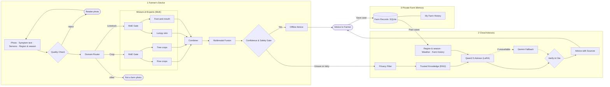

# Architecture Diagram Specification (v5)

**Goal of the diagram:** a reader (judge, partner, new developer) should understand the whole system in **under 30 seconds**, and a technical reader should still see *what technology* each step uses. Rule of thumb: **every box = one icon + a short bold title + (where useful) one small technical tag underneath.** Icons and layout carry the flow; the tag carries the technical term (MoE, RAG, LoRA, ONNX, SQLite…). Not less information, just organised information.

How to use: attach the previous diagram to Gemini as a *style/layout reference only*, paste **Prompt A** (Part 8). If the result has problems use **Prompt D** (Part 11), **Prompt B** (SVG, exact text) or **Prompt C** (one zone at a time).

Status of what is depicted: everything is implemented in the repo except the Qwen advisor's training run (pending). The diagram shows the target architecture; the Gemini fallback already works today.

---
## Part 1: Review history

### 1a. First generated image (v2 output) → problems fixed in v3
Spec text printed on the image (font sizes, "14 pt"), internal IDs like [QC], "49 documents", far too much text with typos, duplicate boxes, "Record case" not reaching Zone 3, weak arrows, cut-off footer, 4:3 low resolution, few icons.

### 1b. Second generated image (v3 output) `updated_architecture_diagram.png`
**Good, keep:** clean and uncluttered; icon on every box; correct colour coding (teal = ours, grey dashed = backup, yellow = decision, red = reject, navy = result); Save case / Past cases now connect Zone 3; only one arrow drops into Zone 2; Qwen is the visual focus; no leaked spec text.

**Problems found → fixed in v4**
| # | Problem in the v3 image | Fix in v4 |
|---|---|---|
| 1 | **Technical identity lost:** "Expert Team", "Learned Gate", "Trusted Knowledge" say nothing about MoE, RAG, LoRA, MobileNetV3/ONNX, FAISS/embeddings, fusion, SQLite, PII removal | Each box gets a **title + small technical tag** (Part 4), e.g. "Trusted Knowledge" + tag "RAG · embeddings + FAISS". Names like MoE, RAG, LoRA, ONNX are now required in the image |
| 2 | **Privacy Filter is orphaned:** it has no incoming or outgoing arrow; the escalation arrow ends on the "Region & season" chip instead | Privacy Filter is the **first box of Zone 2**; the escalation arrow ends on it; arrow Privacy Filter → Trusted Knowledge |
| 3 | The Context chips (region, weather, history) feed *Trusted Knowledge*, so the diagram implies they only affect retrieval, and there is no clear route into the advisor | Context stack joins the **Qwen Advisor** directly with one merged arrow |
| 4 | "Best answer" is tiny and unexplained; it hides the combine logic that fixed routing | Renamed **Combiner**, tag "most confident wins" (livestock: "disease-first" only as tiny tag if space) |
| 5 | Sensors, Quality-check criteria, router type, fusion, gate criteria are not stated | Tags added: "blur · exposure · contrast", "zero-shot vision-language", "image + text + sensors", "confidence · safety-critical · evidence" |
| 6 | "Advice to Farmer" gives no hint of language | Tag "English / Hindi" |
| 7 | Farm Records/My Farm History do not say what storage is used | Tag "SQLite (local)" |
| 8 | Image is again 1200×896 (4:3); the Zone 3 band and Legend are cut by the bottom edge and the legend overlaps the green band | Ask again for wide 16:9 with 6% margin; legend placed in its own free corner **outside every zone band**, or shrunk to a single row under the title |
| 9 | Vertical labels "Crop" / "Livestock" on the left of Expert Team are small and rotated | Use horizontal row labels (small pills) "Crop" and "Livestock" |
| 10 | Yellow hexagon (Quality Check) and yellow diamond (gate) share the decision colour but Quality Check is also a process | Keep both yellow (both accept/reject decisions) but give Quality Check a hexagon and the gate a diamond so they stay distinguishable |
| 11 | "Confident and Safe?" text is small inside the diamond | Diamond made larger; title on two lines |
| 12 | Gemini Backup arrows: dashed from Qwen and dashed to Verify are fine, but the caption "if unavailable" is small | Keep, enlarge caption slightly |

### 1c. Third generated image (v4 output): what is good, what must be fixed
**Good: DO NOT CHANGE these (they are correct now):** title and subtitle; Farmer's Device band layout; phone with Photo / Symptom text / Sensors / Region & season; Retake photo and Not a farm photo boxes; the Mixture-of-Experts container with MoE Gate + Row crops / Tree crops / Lumpy skin / Foot-and-mouth and Combiner; Multimodal Fusion; Offline Advice; Zone 2 main row (Privacy Filter → Trusted Knowledge → Qwen2.5 Advisor → Verify & Cite → Advice with Sources); Context box joining Qwen; Zone 3 band; colours, icons and technical tags; the escalation arrow now correctly ends on Privacy Filter.

**Must be fixed**
| # | Where | Problem seen | Correction |
|---|---|---|---|
| G1 | **Confidence & Safety Gate** | Oversized yellow diamond that bulges to the bottom edge of the Zone 1 band; its title floats ABOVE the diamond, the diamond itself holds only a small shield; the "Yes" and "Unsure or risky" exits are unclear (label sits beside a stray line) | Redesign (Part 2A): a normal-size yellow hexagon (same family as Quality Check), title and tag INSIDE it, two clearly coloured, clearly labelled exits, fully inside the Zone 1 band |
| G2 | Quality Check | Title split across the shape ("Quality" above, "Check" inside) and the tag sits above the hexagon | Title inside the hexagon on two lines, tag directly below the hexagon, nothing above it |
| G3 | Save case arrow | Starts under "Advice with Sources" and ends at "My Farm History" | Must start at the navy "Advice to Farmer" pill and end on the **Farm Records** cylinder |
| G4 | Past cases arrow | Arrowhead points DOWN into Farm Records (direction reversed) | Arrow starts at Farm Records and its arrowhead points UP into the "Farm history" chip |
| G5 | Gemini Fallback | Two dashed arrows between Qwen and Gemini (one going up, suggesting Gemini answers back to Qwen); stray label "Verify" on the arrow to Verify & Cite | Exactly one dashed arrow Qwen → Gemini labelled "if unavailable", one dashed arrow Gemini → Verify & Cite with no label |
| G6 | My Farm History | Stray word: `"private to each farm" useful` | Tag reads exactly: private to each farm (no quotes, no extra word) |
| G7 | Context chip | "Region & season" has a stray asterisk next to the map-pin icon | Remove the asterisk |
| G8 | Domain Router → MoE | The router output enters the container as one arrow, so the Crop / Livestock split is not visible | Two short arrows from the router into the two rows, labelled **Crop** and **Livestock** |
| G9 | Legend | Straddles the Zone 2 / Zone 3 borders and touches the right edge | Single-row legend strip along the very bottom of the image, below all bands, or a box completely inside the empty right part of the Zone 3 band |
| G10 | Advice to Farmer pill | Small, sits half on the Zone 1 border; the tag is cramped | Taller pill fully inside the right margin, spanning the gap between Zone 1 and Zone 2, tag "English / Hindi" on its own line |
| G11 | Escalation arrow route | Runs along the bottom border line of the Zone 1 band | Route it through the middle of the empty corridor between the bands |
| G12 | Aspect ratio | Still 4:3 (about 1200×896), bottom margin very tight | Select **16:9** in the image tool's aspect-ratio option (a request in the prompt alone is often ignored); keep ≥ 6% margin |

---
## Part 2: Design principles
1. **Icon + title + technical tag.** Title ≤ 3 words (bold). Tag ≤ 5 words (small, muted grey-blue, one line). No paragraphs, no bullet lists inside boxes.
2. **Technical terms are required, not optional:** Mixture-of-Experts (MoE), RAG, LoRA, ONNX, MobileNetV3, embeddings + FAISS, zero-shot, multimodal fusion, SQLite, PII removal must appear (once each, in the tags listed in Part 4).
3. **One idea per box; no duplicate boxes; no IDs.**
4. **White space:** about 35-40% of each zone band empty.
5. **Reading order:** Zone 1 left→right; one arrow drops through an empty corridor; Zone 2 left→right; Zone 3 underneath.
6. **Few arrows,** orthogonal, never crossing text or each other. Solid = normal, dashed = backup only, red = reject.
7. **Colour means something:** teal = model we trained; grey dashed = external backup; yellow = decision; red = stop; white = ordinary step; navy = final result.
8. **Formal:** flat vector, thin outlines, no gradients/3D/photos/brand logos.

### 2A. Confidence & Safety Gate: required design
- **Shape:** yellow hexagon, about 1.3× the size of the Quality Check hexagon (do not make it huge), fully inside the Zone 1 band with clear space above and below.
- **Inside the hexagon (all inside, nothing floating outside):** shield icon on top, bold title on two lines **Confidence & Safety Gate**.
- **Directly under the hexagon** (small tag): *confidence · evidence · safety-critical*.
- **Exit 1, to the right:** green solid arrow labelled **Yes** with a small green tick → Offline Advice.
- **Exit 2, downward:** orange-red solid arrow labelled **Unsure or risky** with a small warning-triangle icon next to the label → goes down through the middle of the corridor → Privacy Filter. The label sits beside its own arrow, not near any other line.
- No other lines touch the hexagon except the incoming arrow from Multimodal Fusion.

---
## Part 3: Visual design (INSTRUCTIONS FOR THE GENERATOR: NEVER PRINT ANY OF THIS)
**Canvas.** Wide landscape 16:9, highest resolution available, white background, 6% empty margin on all sides, nothing may touch or cross the image border. Title area ~8% of height; Zone 1 ~34%; Zone 2 ~34%; Zone 3 ~16%; ~4% gap between zones (escalation corridor). Legend sits in the free bottom-right corner **outside** the green band (or as a slim single row directly under the subtitle).

**Text (relative sizes).** Title largest; zone titles second; box titles ≈ 60% of zone-title size, semi-bold, dark; **technical tags ≈ 70% of box-title size, regular, muted slate-blue, one line, always under the title**; arrow labels ≈ 60% of box-title size, italic. All text horizontal, sans-serif, sharp and correctly spelled. Text on teal/navy fills is white.

**Palette (do not print codes).**
| Use | Fill | Outline |
|---|---|---|
| Zone 1 band | very light blue `#EAF1FB` | blue `#2F5D9E` |
| Zone 2 band | very light amber `#FFF4E5` | amber `#C77800` |
| Zone 3 band | very light green `#EAF5EC` | green `#2E7D4F` |
| Ordinary step | white | zone outline colour |
| **Fine-tuned model (ours)** | teal `#0F766E`, white icon and text | dark teal `#0B5A54` |
| External backup model | light grey `#F1F5F9` | grey `#64748B`, dashed |
| Decision | soft yellow `#FDE68A` | brown `#B45309` |
| Reject / stop | light red `#FEE2E2` | red `#B42318` |
| Final result | navy `#1E293B`, white text | none |
| Technical tag text | slate-blue `#475569` (white on dark fills) | |
| Arrows | main: dark slate solid · backup: grey dashed · reject: red solid | |

**Shapes.** Rounded rectangles = steps; hexagon = quality check; diamond = safety gate; cylinder = stores; pill = inputs/outputs. Same size for siblings, grid-aligned, equal spacing.
**Icons.** One consistent flat single-colour line-icon set, about 2.5× label height, placed above or left of the title. No company logos (Gemini and Qwen appear as text).

---
## Part 4: Content: exactly what may be printed
Format: **Title** (bold) / *tag* (small) / Icon (drawing, not text).

### Title block
- **Unified AI Agri-Vision Platform**
- Subtitle: Crop and livestock advisory · Edge-first AI · Retrieval-grounded (RAG) cloud advisory

### Zone 1: badge "1", title **Farmer's Device** + small italic *works offline*
| Step | Title | Tag | Icon |
|---|---|---|---|
| Inputs (3 stacked pills on a phone outline) | **Photo** · **Symptom text** · **Sensors** | *simulated* (under Sensors only) | camera · text lines · thermometer |
| Profile chip | **Region & season** | | map pin + calendar (no asterisk) |
| Quality check (hexagon; title inside, tag directly under the hexagon) | **Quality Check** | *blur · exposure · contrast* | magnifier over photo; green tick = OK; short red arrow → red box **Retake photo** (camera icon) → back to phone |
| Router | **Domain Router** | *crop vs livestock · zero-shot* | split arrow with leaf and cow; red exit → red box **Not a farm photo** |
| Expert container (large white) | **Mixture-of-Experts (MoE)** | *fine-tuned MobileNetV3 · ONNX* | none |
| ·· crop row pill | **Crop** (horizontal pill) | | |
| ·· gate | **MoE Gate** | *learned* | switch/router symbol (small teal box) |
| ·· expert 1 | **Row crops** | | tomato + corn (teal) |
| ·· expert 2 | **Tree crops** | | apple + grapes (teal) |
| ·· livestock row pill | **Livestock** (horizontal pill) | | |
| ·· gate | **MoE Gate** | *learned* | switch/router symbol (small teal box) |
| ·· expert 3 | **Lumpy skin** | | spotted cow (teal) |
| ·· expert 4 | **Foot-and-mouth** | | cow head (teal) |
| Merge | **Combiner** | *most confident wins* | two arrows merging |
| Fusion | **Multimodal Fusion** | *image + text + sensors* | stacked layers / plus |
| Gate (yellow hexagon, see Part 2A; title inside) | **Confidence & Safety Gate** (two lines) | *confidence · evidence · safety-critical* (under the hexagon) | shield; green exit **Yes** (tick); orange-red exit **Unsure or risky** (warning triangle) |
| Offline path | **Offline Advice** | *local knowledge base · season tips* | open book |

### Zone 2: badge "2", title **Cloud Advisory** + small italic *only when needed*
Left to right main row; the Context stack sits in the bottom-left of the zone.
| Step | Title | Tag | Icon |
|---|---|---|---|
| Entry (first box; the escalation arrow ends on its top) | **Privacy Filter** | *personal data removed* | padlock |
| Knowledge | **Trusted Knowledge** | *RAG · embeddings + FAISS* | books + magnifier |
| Context stack (3 chips, bottom-left; one merged arrow into Qwen) | **Region & season** · **Weather** (dashed, optional) · **Farm history** | *tag under stack title "Context"* | map pin + sun · cloud-rain · clock + notebook |
| Primary advisor (largest, teal, thick outline) | **Qwen2.5 Advisor** | *LoRA fine-tuned · cites sources* | brain / chip |
| Backup (grey dashed, placed below the gap between Qwen and Verify) | **Gemini Fallback** | *if Qwen unavailable* | sparkle |
| Verification (hexagon) | **Verify & Cite** | *schema · sources · safety* | shield + check |
| Output | **Advice with Sources** | *structured answer* | document with quote marks |

### Result pill (navy, far right, spanning Zone 1 and Zone 2)
**Advice to Farmer** / *English / Hindi* / phone with speech bubble. Arrows in from Offline Advice and from Advice with Sources.

### Zone 3: badge "3", title **Private Farm Memory**
| Item | Title | Tag | Icon |
|---|---|---|---|
| Store (cylinder) | **Farm Records** | *SQLite (local)* | database + leaf + cow |
| Timeline (white, phone outline) | **My Farm History** | *private to each farm* (exact text, no quotes, no extra words) | timeline / clock + notebook |
Nothing else in Zone 3.

### Arrows (complete list; no others)
1. Inputs → Quality Check. Quality Check → Domain Router (green tick). Quality Check → Retake photo (red) → back to Inputs.
2. Domain Router → two short arrows into the two MoE rows: **Crop** (to the Crop row) and **Livestock** (to the Livestock row); → Not a farm photo (red).
3. Each gate → its two experts. All four experts → Combiner → Multimodal Fusion → Confidence & Safety Gate.
4. Gate → Offline Advice (**Yes**) → Advice to Farmer.
5. Gate → down through the MIDDLE of the empty corridor (not along a band border) → **Privacy Filter** (**Unsure or risky**). The only arrow crossing from Zone 1 to Zone 2.
6. Privacy Filter → Trusted Knowledge → Qwen2.5 Advisor. Context stack → Qwen2.5 Advisor (one merged arrow).
7. Qwen → Verify & Cite (**solid**). Qwen → Gemini Fallback: exactly ONE dashed arrow (label **if unavailable**), no return arrow. Gemini Fallback → Verify & Cite: one dashed arrow, no label.
8. Verify & Cite → Advice with Sources → Advice to Farmer.
9. Advice to Farmer (the navy pill) → **Farm Records** cylinder (**Save case**; it must not end on My Farm History). Farm Records → My Farm History. Farm Records → Farm history chip in Zone 2 (**Past cases**; arrowhead points UP into the chip; one vertical arrow crossing nothing).

### Legend (a single-row strip along the very bottom of the image below all bands, or a box fully inside the empty right part of the Zone 3 band; never straddling a band border; title **Legend**)
7 entries: teal box **Fine-tuned AI model** · grey dashed box **External fallback** · yellow **Decision** · cylinder **Data store** · red box **Rejected** · solid arrow **Main path** · dashed arrow **Fallback path**.

Do not print: any footer sentence, font/size/colour codes, IDs, square brackets, counts of documents/classes/images, percentages, accuracy figures.

---
## Part 5: Must NOT appear
On-device model improvement / secure aggregation / federated learning; voice, speech, microphone, audio; Gemini as the main generator; Qwen as optional; numbers of anything; any text about how the picture was made.

## Part 6: Checklist to review the generated image
- [ ] Wide 16:9; nothing cut at any edge; legend does not overlap a zone band.
- [ ] Text legible at half size; correctly spelled.
- [ ] Technical terms present: MoE, MobileNetV3/ONNX, zero-shot, Multimodal Fusion, RAG + FAISS, Qwen2.5 + LoRA, Gemini Fallback, SQLite, personal data removed.
- [ ] Every box: one icon, short bold title, at most one small tag line.
- [ ] Privacy Filter has an incoming arrow (from the gate) and an outgoing one (to Trusted Knowledge).
- [ ] Context stack joins Qwen; Qwen → Verify is solid; only Gemini arrows dashed.
- [ ] Only one arrow from Zone 1 to Zone 2; "Save case" reaches Zone 3; "Past cases" returns.
- [ ] No IDs/brackets/sizes/counts printed; no duplicate steps.
- [ ] Confidence & Safety Gate: yellow hexagon, title inside, tag under, two labelled exits (green Yes, orange-red Unsure or risky), fully inside the Zone 1 band.
- [ ] Save case starts at the navy pill and ends at Farm Records; Past cases points UP into the Farm history chip.
- [ ] Exactly one dashed arrow Qwen → Gemini, no return arrow; no stray label "Verify".
- [ ] No stray words or symbols ("useful", asterisk).

---
## Part 7: Structure reference (Mermaid, connectivity only; ignore its styling)

---
## Part 8: PROMPT A (main: paste into Gemini with the previous diagram attached as style reference)

> Create ONE formal, clean **system architecture diagram** as a flat vector-style image: **wide landscape 16:9, highest resolution available, white background, at least 6% empty margin on every side, nothing cut off at the edges.** Title "Unified AI Agri-Vision Platform"; subtitle "Crop and livestock advisory · Edge-first AI · Retrieval-grounded (RAG) cloud advisory".
>
> **Content style (important):** every box has (1) one clear single-colour line icon, (2) a short **bold title** of at most three words, and (3) where listed below, ONE small muted slate-blue **technical tag** line under the title (the tag is the technical term). No paragraphs, no bullet lists, lots of white space. The diagram must be instantly understandable AND show the technology used. Technical terms MoE, MobileNetV3, ONNX, zero-shot, RAG, FAISS, LoRA, SQLite must appear exactly where listed.
>
> I attached my previous diagram only as a style/layout reference (three coloured horizontal zone bands stacked top to bottom, numbered circle badges, teal boxes for our models, grey dashed fallback, navy result pill). Keep that look, but follow the content below exactly.
>
> **Layout.** Three horizontal bands: Zone 1 (light blue) titled "Farmer's Device" with small italic "works offline"; Zone 2 (light amber) titled "Cloud Advisory" with small italic "only when needed"; Zone 3 (light green) titled "Private Farm Memory". Leave an empty horizontal corridor between Zone 1 and Zone 2 for exactly one arrow. A tall navy pill "Advice to Farmer" with tag "English / Hindi" (phone with speech-bubble icon) sits at the far right, spanning Zone 1 and Zone 2. The legend is a single-row strip along the very bottom of the image, below all bands, touching no edge.
>
> **Zone 1, left to right (title / tag):** a phone outline with three pills "Photo" (camera), "Symptom text" (text lines), "Sensors" (thermometer, tag "simulated"), and a chip "Region & season" (map pin, calendar) → hexagon **Quality Check** (title inside the hexagon, tag "blur · exposure · contrast" directly under it; magnifier-over-photo icon) with a green tick to continue, and a short red arrow to a red box "Retake photo" (camera icon) that points back to the phone → **Domain Router** / "crop vs livestock · zero-shot" (split arrow with a leaf and a cow) with a red exit to a red box "Not a farm photo", and two short arrows labelled "Crop" and "Livestock" leading into the two rows of → one large white container titled **Mixture-of-Experts (MoE)** with tag "fine-tuned MobileNetV3 · ONNX". Inside, two rows with small horizontal pills "Crop" and "Livestock". Crop row: small teal box **MoE Gate** / "learned" feeding two teal boxes **Row crops** (tomato and corn icons) and **Tree crops** (apple and grapes icons). Livestock row: small teal box **MoE Gate** / "learned" feeding two teal boxes **Lumpy skin** (spotted cow icon) and **Foot-and-mouth** (cow head icon). All four expert boxes merge into a small white box **Combiner** / "most confident wins" → **Multimodal Fusion** / "image + text + sensors" (layers icon) → a yellow **hexagon** (not a big diamond; about 1.3× the size of the Quality Check hexagon, fully inside the blue band) with a shield icon and the bold two-line title **Confidence & Safety Gate** INSIDE it, and the small tag "confidence · evidence · safety-critical" directly under it. Two exits only: a green arrow to the right labelled "Yes" (with a small green tick) → **Offline Advice** / "local knowledge base · season tips" (open book) → the navy pill; and an orange-red arrow going DOWN, labelled "Unsure or risky" with a small warning-triangle icon next to the label, through the MIDDLE of the empty corridor between the bands to the first box of Zone 2.
>
> **Zone 2, left to right:** **Privacy Filter** / "personal data removed" (padlock) — the downward arrow ends on this box → **Trusted Knowledge** / "RAG · embeddings + FAISS" (books and magnifier) → the largest teal box with a thick outline **Qwen2.5 Advisor** / "LoRA fine-tuned · cites sources" (brain or chip icon). In the bottom-left of Zone 2 a small stack titled "Context" with three chips "Region & season" (map pin and sun), "Weather" (dashed outline, cloud-rain icon), "Farm history" (clock and notebook); ONE merged arrow from this stack goes into the Qwen box. A light-grey dashed box **Gemini Fallback** / "if Qwen unavailable" (sparkle icon) sits below the gap between Qwen and the next box, connected by exactly one dashed arrow Qwen → Gemini (label "if unavailable", no return arrow) and one unlabelled dashed arrow Gemini → Verify & Cite. From Qwen a SOLID arrow goes to hexagon **Verify & Cite** / "schema · sources · safety" (shield with check) → **Advice with Sources** / "structured answer" (document with quote marks) → arrow up into the navy "Advice to Farmer" pill.
>
> **Zone 3:** cylinder **Farm Records** / "SQLite (local)" (database with a small leaf and cow) and a box **My Farm History** / "private to each farm" (timeline icon), joined by an arrow. An arrow starting at the navy pill and ending on the Farm Records cylinder, labelled "Save case" (it must NOT end on My Farm History). One vertical arrow starting at Farm Records with its arrowhead pointing UP into the "Farm history" chip in Zone 2, labelled "Past cases", crossing nothing.
>
> **Colours.** Teal fill with white icon/text ONLY for models we trained (the two MoE gates, the four experts, Qwen2.5 Advisor). Grey with dashed outline for the external fallback (Gemini). Yellow for decisions (Quality Check hexagon, safety-gate diamond). Light red for rejected outcomes. Navy for the final result. White for other steps. Solid dark arrows for the main path, grey dashed arrows only for the fallback path, red arrows for rejects. Zone bands very light blue / amber / green with matching thin outlines.
>
> **Legend (7 entries, compact):** teal box "Fine-tuned AI model", grey dashed box "External fallback", yellow "Decision", cylinder "Data store", red box "Rejected", solid arrow "Main path", dashed arrow "Fallback path".
>
> **Rules.** Flat vector, consistent line icons, thin outlines, no gradients/3D/photos/logos; all text horizontal, sharp, correctly spelled, large enough to read at half size; arrows straight or right-angled, never crossing text or each other; only ONE arrow crosses from Zone 1 into Zone 2. **Do not print:** font names or sizes, colour codes, square brackets, step IDs, image dimensions, numbers of documents/classes/images, percentages, a footer sentence. **Do not include:** voice/speech/microphone, "on-device model improvement", "secure aggregation", or "federated learning". Use ONLY the titles and tags given above, spelled exactly.

---
## Part 9: PROMPT B (alternative: ask for SVG code, so text is never misspelt)
> Write ONE self-contained **SVG file** (viewBox 1920×1080, 16:9, white background, system sans-serif font, no external files) of the architecture diagram described below. Output only the SVG code in a single code block. Draw simple flat line icons with basic shapes (camera, text lines, thermometer, magnifier, leaf, cow, tomato, apple, shield, padlock, books, brain/chip, cylinder, clock, phone). Use exactly the titles, small technical tag lines, colours, layout and arrows from the specification that follows (paste Parts 3, 4 and 5 of this file, then the Layout paragraph of Prompt A). Keep it uncluttered with generous white space. Do not print sizes, colour codes or IDs as text.

Open the SVG in a browser and export to PNG, or edit it in Inkscape/Figma/PowerPoint.

## Part 10: PROMPT C (fallback: one zone at a time, then assemble)
> Using the same style and palette as before, create only **Zone 1: Farmer's Device** as a wide 16:9 image (content: Part 4 Zone 1 table, including titles and tag lines). Then only **Zone 2: Cloud Advisory**, then only **Zone 3: Private Farm Memory**, each on plain white with identical fonts, colours and icon style, leaving a short stub arrow at each edge where it connects to the next zone ("Unsure or risky" leaves Zone 1 downward; "Save case"; "Past cases").

Assemble in PowerPoint/Figma/Canva and re-check every label against Part 4.

## Part 11: PROMPT D (fix-up follow-up when a result has problems)
> Redo the image with these corrections, keeping the same layout, colours and icon style. (1) Each box must show: an icon, a short bold title and, where listed, ONE small technical tag line. Restore the technical terms: "Mixture-of-Experts (MoE)" with tag "fine-tuned MobileNetV3 · ONNX"; "MoE Gate" with tag "learned"; "Domain Router" with tag "crop vs livestock · zero-shot"; "Multimodal Fusion" with tag "image + text + sensors"; "Confidence & Safety Gate"; "Privacy Filter" with tag "personal data removed"; "Trusted Knowledge" with tag "RAG · embeddings + FAISS"; "Qwen2.5 Advisor" with tag "LoRA fine-tuned · cites sources"; "Gemini Fallback" with tag "if Qwen unavailable"; "Verify & Cite" with tag "schema · sources · safety"; "Farm Records" with tag "SQLite (local)"; "Advice to Farmer" with tag "English / Hindi". (2) The escalation arrow "Unsure or risky" must end on "Privacy Filter", and "Privacy Filter" must have an arrow to "Trusted Knowledge" then to "Qwen2.5 Advisor". (3) The Context stack (Region & season, Weather, Farm history) must join "Qwen2.5 Advisor" with one merged arrow. (4) "Qwen2.5 Advisor" to "Verify & Cite" must be a SOLID arrow; only Gemini arrows are dashed. (5) Use horizontal pills "Crop" and "Livestock" instead of vertical text. (6) Make the image wide 16:9 with at least 6% empty margin; nothing cut off; the Legend must be outside the green band and not touch the image edge. (7) Do not print font sizes, colour codes, step IDs, brackets, or counts of documents/classes. (8) Keep the text large and correctly spelled. (9) Redraw the Confidence & Safety Gate as a normal-size yellow hexagon fully inside the blue band, with the shield icon and the two-line title INSIDE it and the tag "confidence · evidence · safety-critical" under it; a green "Yes" arrow to Offline Advice and an orange-red "Unsure or risky" arrow (warning-triangle icon) down through the middle of the corridor.

---
## Part 11b: PROMPT R (REFINEMENT: use this first on your current good image; changes ONLY what is listed)
Attach `updated_architecture_diagram.png` (the current image) and paste:

> This diagram is almost final. **Keep everything exactly as it is** (layout, colours, icons, text, box positions, sizes, arrows) **except the corrections listed below. Do not redraw, restyle, move or reword anything else.** Output the same image with only these changes:
>
> 1. **Confidence & Safety Gate (main fix).** Replace the large yellow diamond with a normal-size yellow hexagon (about 1.3 times the Quality Check hexagon) that sits fully inside the blue Zone 1 band with clear space above and below. Put the shield icon and the bold two-line title "Confidence & Safety Gate" INSIDE the hexagon, and the small tag "confidence · evidence · safety-critical" directly under it. Nothing may float above it. Give it exactly two exits: a green arrow to the right labelled "Yes" (small green tick) into Offline Advice, and an orange-red arrow labelled "Unsure or risky" (small warning-triangle icon next to the label) going down through the middle of the empty gap between the two bands into Privacy Filter.
> 2. **Quality Check:** put the whole title "Quality Check" inside the hexagon (two lines) and the tag "blur · exposure · contrast" directly under it; nothing above the hexagon.
> 3. **Domain Router:** add two short labelled arrows "Crop" and "Livestock" from the router into the Crop row and the Livestock row of the Mixture-of-Experts box.
> 4. **Save case arrow:** it must start at the navy "Advice to Farmer" pill and end on the Farm Records cylinder (currently it ends at My Farm History).
> 5. **Past cases arrow:** reverse it: it starts at Farm Records and its arrowhead points up into the "Farm history" chip.
> 6. **Gemini Fallback:** keep exactly one dashed arrow from Qwen2.5 Advisor to Gemini Fallback labelled "if unavailable" (remove the extra upward dashed arrow), and one unlabelled dashed arrow from Gemini Fallback to Verify & Cite (remove the stray label "Verify").
> 7. **Typos:** the text under My Farm History must read exactly "private to each farm" (remove the quotes and the word "useful"); remove the asterisk next to the map-pin icon on the "Region & season" chip.
> 8. **Legend:** move it out of the amber/green bands into a single-row strip along the very bottom of the image (or entirely inside the empty right part of the green band); it must not touch any edge.
> 9. **Advice to Farmer pill:** make it a taller navy pill placed fully in the right margin, spanning the gap between Zone 1 and Zone 2, with "English / Hindi" on its own line.
> 10. **Escalation arrow:** route it through the middle of the empty gap between the bands, not along a band border.
> 11. Output at 16:9 with at least 6% empty margin on all sides; nothing cut off.

If the tool cannot edit precisely and changes other parts, go back to the previous image and use Prompt D (which regenerates the whole image with the same fixes).

---
## Part 12: Notes for maintainers
- Accuracy numbers and document counts are intentionally not on the diagram (see `docs/system/evaluation_results.md`).
- "Combiner" corresponds to `AGRIVISION_MOE_ROUTING=both` (recommended). With `top1` the learned gate alone picks one expert.
- Qwen box: trained on synthetic, human-reviewed advisories; until fine-tune and comparison finish, Gemini is the default backend (`ADVISORY_BACKEND=local_llm` switches to Qwen).
- After generating, save the final image over `architecture_diagram.png` (the README uses that name).
