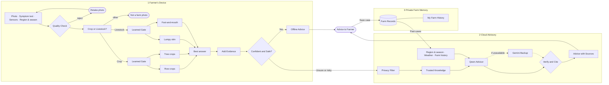

# Architecture Diagram Specification (v3)

**Goal of the diagram:** a reader (judge, farmer-facing partner, new developer) should understand the whole system in **under 30 seconds**: *photo goes in → quality check → expert models on the farmer's device → either instant offline advice, or (if unsure or risky) a cloud advisor that uses trusted knowledge and the farm's own history → advice comes back and is saved.* If the picture is crowded or needs reading paragraphs, it has failed. **Icons and layout carry the meaning; text is only a short label.**

How to use this file: attach the previous diagram (`architecture_diagram.png`) to Gemini as a layout reference only, then paste **Prompt A** (Part 8). If the result has problems, use **Prompt D** (Part 11) to fix them, or try **Prompt B** (SVG, exact text) or **Prompt C** (one zone at a time). Everything else in this file is the detailed spec behind the prompts.

Status of what is depicted: everything is implemented in the repo except the Qwen advisor's training run (pending). The diagram shows the target architecture; the Gemini fallback path already works today.

---
## Part 1: Review of the generated image `updated_architecture_diagram.png` (v2 output)

**Kept (good):** three stacked zones with numbered badges; consistent teal for models fine-tuned in this project; grey dashed Gemini fallback; red reject boxes; yellow decision gates; phone icon for inputs; legend concept; left-to-right reading in Zone 1.

**Problems found, and the fix in this v3 spec**
| # | Problem seen in the image | Why it hurts | Fix in v3 |
|---|---|---|---|
| 1 | Spec text leaked into the picture: subtitle ends with "(30 px regular)"; top-right says "Minimum text equivalent 14 pt, Inter font" | Looks unprofessional; wrong | Sizes are given only as relative proportions inside a section marked **"instructions, never print"**; Prompt says: never print sizes, fonts, hex codes, IDs |
| 2 | Internal IDs printed everywhere: [IN], [QC], [DR], [MOE], [E1]…[E4], [CB], [FU], [CG], [LA], [OUT], [GW], [CTX], [RAG], [KB], [QW], [GM], [VAL], [CADV], [FR], [TL] | Clutter, meaningless to readers | Nodes are referred to by **name only**; IDs removed from this spec; Prompt forbids brackets |
| 3 | "49 documents" printed in the knowledge-base box | You asked to remove it; also goes stale | Removed everywhere |
| 4 | Far too much text: sub-labels with class lists ("21 classes: tomato, potato, maize…"), sentences inside boxes (e.g. "Schema · grounded in inputs · no drug doses · cited IDs must exist") | Unreadable at normal size; crowded | **Max 4 words per label, no sub-sentences.** Detail moved to icons (tomato, apple, cow…) and to the docs |
| 5 | AI-rendered text is garbled/misspelt: "srope: 21 olasses", "sopaeh", "Ali experts", "sero-shot", "reasoning doown te the farmer", "Farm proffile", "fille path", "citations" typos, "cotident expert" | Wrong words in a formal diagram | Fewer, shorter words (fewer chances to garble); **Prompt B** generates SVG so text is exact; Part 10 lists the labels for a final check |
| 6 | Duplicate boxes: "Capture and Quality Check" title AND a hexagon labelled "[QC]"; same for "Confidence and Safety Gate" AND a diamond "[CG]" | Reader thinks there are two steps | **One node per step**: the shape *is* the node, the name is inside it |
| 7 | "Record case" arrow does **not** reach Zone 3; it ends at the Structured Advisory box, and a double-headed arrow links Farmer-Facing Result and Structured Advisory | The memory step is not visible; arrows misleading | Explicit arrows: Result → Farm Records ("Save case") and Farm Records → Context ("Past cases") only |
| 8 | Region arrow goes from a "Farm profile" chip up to the *Cloud Gateway* | Region should travel with the case, not from memory to the gateway | Region & season is a chip in Inputs and a chip in the Context strip; no arrow needed |
| 9 | The "Retake" return arrow and the "Escalate to cloud" line share one long path along the bottom of Zone 1 and cross the Zone 1 border | Hard to trace | Reject arrows are short and local; a **reserved empty corridor** between Zone 1 and Zone 2 is used by the escalation arrow only |
| 10 | Main flow Qwen → Validator drawn as a dashed grey arrow (same style as fallback) | Looks like Qwen is optional | Qwen → Verify is a **solid** arrow; only Gemini paths are dashed |
| 11 | Tiny notes next to the gate ("Low confidence · conflicting symptoms · poor image · safety-critical disease (eg…") squeezed into a narrow column | Illegible | Replaced by one short label "Unsure or risky" plus a warning icon |
| 12 | Legend repeats "Data store / knowledge base" twice; zone swatches duplicate the zone titles; legend is large | Wasted space, noise | 7 unique entries, compact |
| 13 | Image is 1200×896 (4:3) and low resolution; footer sentence is cut off at the bottom edge | Text is small, footer clipped | Ask for **wide 16:9**, highest resolution available, 6% safe margin all round, footer removed |
| 14 | Zone 3 is small and squeezed; the green box is cut by the Legend; farm history arrow crosses the Context list | Memory looks like an afterthought | Zone 3 gets a full-width band with two large boxes; Legend moves to a dedicated corner that overlaps nothing |
| 15 | Almost no pictograms; only a phone, a cloud and cylinders | Reader must read everything | Every node gets a **specific icon** (Part 4) |
| 16 | The Combiner and "gate probability (tie-break)" dashed lines add clutter inside the expert block | Detail nobody needs at this level | Combiner kept as one small node; tie-break line removed |

---
## Part 2: Design principles (follow these when choosing between options)
1. **Icons first, words second.** A box = one icon + a label of at most 4 words.
2. **One idea per box.** No duplicate boxes, no boxes that only hold an ID.
3. **Generous white space.** Roughly 40% of each zone band should be empty. If it does not fit, delete detail, do not shrink text.
4. **Read left → right, top → bottom.** Zone 1 left→right; escalation drops down; Zone 2 left→right; Zone 3 underneath.
5. **Few arrows, orthogonal, never crossing text or each other.** Solid = normal path. Dashed = backup only. Red = rejected.
6. **Colour means something:** teal = model we trained; grey dashed = external backup; yellow = decision; red = stop; white = ordinary step; navy = final result shown to the farmer.
7. **Formal look:** flat vector, thin outlines, no gradients, no 3D, no shadows heavier than a faint hairline, no decorative photos, no brand logos.

---
## Part 3: Visual design (INSTRUCTIONS FOR THE GENERATOR, NEVER PRINT ANY OF THIS ON THE IMAGE)

**Canvas.** Wide landscape 16:9, highest resolution available, white background, 6% empty margin on every side. Title area about 8% of image height. Zone 1 about 34%, Zone 2 about 38%, Zone 3 about 16% of the height; a clear gap of about 4% between zones (the escalation corridor).

**Text sizes (relative).** Title = largest text on the image. Zone titles = second largest. Box labels = about 60% of zone-title size, semi-bold. Arrow labels = about 45% of zone-title size, italic. Nothing smaller than arrow labels. All text horizontal, dark slate colour on light fills, white on dark fills, sans-serif typeface (Inter/Roboto style).

**Palette (colour names for you; do not print codes).**
| Use | Fill | Outline |
|---|---|---|
| Zone 1 band (edge, farmer's device) | very light blue `#EAF1FB` | blue `#2F5D9E` |
| Zone 2 band (cloud advisory) | very light amber `#FFF4E5` | amber `#C77800` |
| Zone 3 band (farm memory) | very light green `#EAF5EC` | green `#2E7D4F` |
| Ordinary step | white | same colour as its zone outline |
| **Fine-tuned model (ours)** | teal `#0F766E`, white icon and text | dark teal `#0B5A54` |
| External backup model | light grey `#F1F5F9` | grey `#64748B`, dashed |
| Decision gate | soft yellow `#FDE68A` | brown `#B45309` |
| Reject / stop | light red `#FEE2E2` | red `#B42318` |
| Final result shown to farmer | navy `#1E293B`, white text | none |
| Main arrow | dark slate `#1E293B`, medium thickness, solid | |
| Backup arrow | grey `#64748B`, medium, dashed | |
| Reject arrow | red `#B42318`, medium, solid | |

**Shapes.** Rounded rectangles for steps; diamond for decisions; cylinder for data stores; pill for inputs/outputs. Same size for sibling boxes, aligned on a grid, equal spacing.

**Icons.** One consistent set: flat, single-colour line icons with rounded ends, drawn inside or above each label. Icon size about the height of the label text × 2.5. White icons on teal/navy fills, dark icons elsewhere. No logos of real companies (Gemini and Qwen are shown by their names as text).

---
## Part 4: Content (this is exactly what may be printed; "Icon" is a drawing, not text)

### Title block (print)
- Title: **Unified AI Agri-Vision Platform**
- Subtitle: **Crop and livestock advisory · Edge-first · Grounded in trusted knowledge**

### Zone 1: badge "1", print title: **Farmer's Device** with small italic **works offline**
| Step (left → right) | Printed label (exact) | Icon | Notes |
|---|---|---|---|
| Inputs (3 stacked pills on a phone outline) | **Photo** · **Symptom text** · **Sensors** and a small chip **Region & season** | camera · text-lines · thermometer · map pin + calendar | Sensors are simulated: no extra text |
| Quality check (hexagon) | **Quality Check** | magnifying glass over a photo | Two small exits: green tick "OK" continues; red box **Retake photo** with a short arrow back to the phone |
| Domain router (rounded box) | **Crop or Livestock?** | fork/split arrow with a leaf and a cow | Third exit, red box **Not a farm photo** |
| Expert team (large white container) | container title **Expert Team** and a tiny caption **fine-tuned AI models** | none on container | Contains the boxes below |
| ·· gate (crop) | **Learned Gate** | traffic-switch / router symbol | small teal box |
| ·· expert 1 | **Row crops** | tomato + corn | teal box |
| ·· expert 2 | **Tree crops** | apple + grapes | teal box |
| ·· gate (livestock) | **Learned Gate** | traffic-switch | small teal box |
| ·· expert 3 | **Lumpy skin** | cow with spots | teal box |
| ·· expert 4 | **Foot-and-mouth** | cow head | teal box |
| ·· merge | **Best answer** | two arrows merging into one | small white box after the four experts |
| Fusion | **Add Evidence** | stacked layers / plus | white box: combines symptom text and sensors with the photo result |
| Confidence & safety (diamond) | **Confident and Safe?** | shield | Two exits: **Yes** (solid, to Offline Advice) and **Unsure or risky** (solid, down to the cloud, with a small warning-triangle icon) |
| Offline advice | **Offline Advice** | open book | white box; then arrow to the Result pill |

### Zone 2: badge "2", print title: **Cloud Advisory** with small italic **only when needed**
| Step (left → right) | Printed label (exact) | Icon | Notes |
|---|---|---|---|
| Entry | **Privacy Filter** | padlock | white box; the escalation arrow ends here; caption none |
| Context strip (3 small chips stacked, feeding the advisor) | **Region & season** · **Weather** · **Farm history** | map pin + sun · cloud with rain · clock with notebook | **Weather** chip has a dashed outline (optional) |
| Knowledge search | **Trusted Knowledge** | stack of books + magnifying glass (or cylinder with a book) | one box; no numbers; no sub-lines |
| Primary advisor (largest, teal, thick outline) | **Qwen Advisor** and a small tag **fine-tuned** | brain / chip | The visual focus of Zone 2 |
| Backup advisor (below Qwen, grey dashed) | **Gemini Backup** | sparkle or cloud (generic, no logo) | small caption **if Qwen unavailable** |
| Verification (diamond or hexagon) | **Verify and Cite** | shield with check mark | |
| Structured advice | **Advice with Sources** | document with quote marks | white box; arrow goes up to the Result pill |

### Result pill (navy), at the far right, tall enough to touch both Zone 1 and Zone 2
Print: **Advice to Farmer**, icon: phone with a speech bubble. Two arrows enter it: from **Offline Advice** (Zone 1) and from **Advice with Sources** (Zone 2).

### Zone 3: badge "3", print title: **Private Farm Memory**
| Item | Printed label (exact) | Icon |
|---|---|---|
| Store (cylinder) | **Farm Records** | database cylinder with a small leaf and cow |
| Timeline (white box, phone outline) | **My Farm History** | timeline / clock with notebook |
A small italic line under the timeline: **private to each farm**.

**Nothing else in Zone 3** (no model-improvement, aggregation or update boxes).

### Arrows (complete list; every other connection is forbidden)
Solid unless stated. Labels only where quoted.
1. Inputs → Quality Check.
2. Quality Check → Crop or Livestock? (label none; green tick icon).
3. Quality Check → **Retake photo** (red) → short arrow back to Inputs.
4. Crop or Livestock? → crop Learned Gate (label **Crop**); → livestock Learned Gate (label **Livestock**); → **Not a farm photo** (red).
5. Each Learned Gate → its two experts. All four experts → **Best answer**.
6. **Best answer** → **Add Evidence** → **Confident and Safe?**.
7. **Confident and Safe?** → **Offline Advice** (label **Yes**) → **Advice to Farmer**.
8. **Confident and Safe?** → down through the empty corridor → **Privacy Filter** (label **Unsure or risky**). This is the only arrow that crosses the Zone 1/Zone 2 border going down.
9. **Privacy Filter** → **Trusted Knowledge**; Context chips → **Qwen Advisor** (one merged arrow); **Trusted Knowledge** → **Qwen Advisor**.
10. **Qwen Advisor** → **Verify and Cite** (solid). **Qwen Advisor** → **Gemini Backup** (dashed, label **if unavailable**). **Gemini Backup** → **Verify and Cite** (dashed).
11. **Verify and Cite** → **Advice with Sources** → **Advice to Farmer**.
12. **Advice to Farmer** → **Farm Records** (label **Save case**).
13. **Farm Records** → **Farm history** chip in Zone 2 (label **Past cases**), one vertical arrow that does not cross any other arrow.

### Legend (compact box in the bottom-right corner, overlapping nothing; print title **Legend**)
7 entries only: teal box **Fine-tuned AI model** · grey dashed box **External backup** · yellow diamond **Decision** · cylinder **Data store** · red box **Rejected** · solid arrow **Main path** · dashed arrow **Backup path**.

Do **not** print: any footer sentence, image sizes, fonts, colour codes, step IDs, square brackets, counts of documents/classes/images, percentages, model file sizes.

---
## Part 5: Things that must NOT appear
- On-device model improvement, secure aggregation, federated learning, "improved models".
- Voice, speech, microphone, audio.
- Gemini as the main generator; Qwen as optional.
- Numbers of anything (documents, classes, accuracy).
- Any text describing how the picture was made (px, pt, font names, hex codes, "regular", "semibold").

## Part 6: Checklist to review the generated image (tick all)
- [ ] Wide 16:9, all text legible when the image is shown at half size.
- [ ] No spec text, brackets, IDs, sizes, hex codes printed.
- [ ] No word is misspelt; labels match Part 4 exactly.
- [ ] Every box has an icon; no box has more than 4 words.
- [ ] No duplicate steps (Quality Check once, Confident and Safe? once).
- [ ] Qwen is the visual focus of Zone 2; Gemini is grey and dashed and below it.
- [ ] Only one arrow crosses from Zone 1 to Zone 2; "Save case" reaches Zone 3; "Past cases" comes back.
- [ ] No arrow crosses text or another arrow.
- [ ] Legend has 7 unique entries and covers nothing.

---
## Part 7: Structure reference (Mermaid; for connectivity only, ignore its styling; names below are the printed labels)

---
## Part 8: PROMPT A (main prompt: paste this into Gemini with the previous diagram attached)

> Create ONE formal, clean, easy-to-read **system architecture diagram** as a flat vector-style image, **wide landscape 16:9, highest resolution available, white background, generous empty margins**. Title: "Unified AI Agri-Vision Platform". Subtitle: "Crop and livestock advisory · Edge-first · Grounded in trusted knowledge".
>
> **Top priority: it must be instantly understandable and NOT crowded.** Use small icons instead of text. Every box has ONE clear icon and a label of at most four words. Leave lots of empty space. If something does not fit, remove detail; never shrink text.
>
> I attached my previous diagram only as a reference for the general look (three coloured horizontal zone bands stacked top to bottom with a numbered circle badge, a legend at the bottom right). **Do not copy its content or its clutter.**
>
> **Layout.** Three horizontal bands. Zone 1 (top, light blue): title "Farmer's Device" with small italic "works offline". Zone 2 (middle, light amber): title "Cloud Advisory" with small italic "only when needed". Zone 3 (bottom, light green): title "Private Farm Memory". Leave an empty horizontal gap between Zone 1 and Zone 2 for one arrow. A tall navy pill "Advice to Farmer" (phone with speech-bubble icon) sits at the far right, touching both Zone 1 and Zone 2. Small compact legend in the bottom-right corner.
>
> **Zone 1, left to right:** phone outline with three stacked pills "Photo" (camera icon), "Symptom text" (text-lines icon), "Sensors" (thermometer icon) and a small chip "Region & season" (map-pin and calendar icon) → hexagon "Quality Check" (magnifying glass over photo) with a green tick to continue and a short red arrow to a red box "Retake photo" that points back to the phone → box "Crop or Livestock?" (split arrow with a leaf and a cow) with a red exit to a red box "Not a farm photo" → a large white container titled "Expert Team" with caption "fine-tuned AI models". Inside it two rows. Row "Crop": small teal box "Learned Gate" feeding two teal boxes "Row crops" (tomato and corn icons) and "Tree crops" (apple and grapes icons). Row "Livestock": small teal box "Learned Gate" feeding two teal boxes "Lumpy skin" (spotted cow icon) and "Foot-and-mouth" (cow head icon). All four expert boxes merge into a small white box "Best answer" → white box "Add Evidence" (layers icon) → yellow diamond "Confident and Safe?" (shield icon). From the diamond: "Yes" goes to white box "Offline Advice" (open-book icon) then to "Advice to Farmer"; "Unsure or risky" (small warning triangle) goes DOWN through the empty gap into Zone 2.
>
> **Zone 2, left to right:** white box "Privacy Filter" (padlock) → box "Trusted Knowledge" (books and magnifying glass) → the largest teal box with a thick outline "Qwen Advisor" with a small tag "fine-tuned" (brain or chip icon). Three small stacked chips feed the Qwen box: "Region & season", "Weather" (dashed outline, cloud-rain icon) and "Farm history" (clock and notebook icon). Below the Qwen box a light-grey dashed box "Gemini Backup" (sparkle icon) with small caption "if unavailable", connected from Qwen by a dashed arrow. From Qwen a SOLID arrow, and from Gemini Backup a dashed arrow, both go to a shield-with-check hexagon "Verify and Cite" → white box "Advice with Sources" (document with quote marks) → arrow up to "Advice to Farmer".
>
> **Zone 3:** a cylinder "Farm Records" (database with small leaf and cow) and a box "My Farm History" (timeline icon) with small italic text "private to each farm". Arrow from "Advice to Farmer" down to "Farm Records" labelled "Save case". One vertical arrow from "Farm Records" up to the "Farm history" chip in Zone 2, labelled "Past cases".
>
> **Colours.** Teal fill with white icon/text ONLY for models we trained (the four experts, the two gates, Qwen Advisor). Grey with dashed outline for the external backup (Gemini). Yellow for decision gates. Light red for rejected outcomes. Navy for the final result. White for all other steps. Solid dark arrows for the main path, grey dashed arrows for the backup path, red arrows for rejects. Zone bands: very light blue, very light amber, very light green with matching thin outlines.
>
> **Legend (7 entries, compact):** teal box "Fine-tuned AI model", grey dashed box "External backup", yellow diamond "Decision", cylinder "Data store", red box "Rejected", solid arrow "Main path", dashed arrow "Backup path".
>
> **Style rules.** Flat vector look; consistent single-colour line icons; thin outlines; no gradients, no 3D, no photos, no company logos; all text horizontal, sans-serif, large and legible, correctly spelled; arrows are straight or right-angled and never cross text or each other; only ONE arrow crosses from Zone 1 into Zone 2.
>
> **Never print** any of the following on the image: numbers of documents/classes/images, percentages, font names or sizes, colour codes, square brackets, step IDs, image dimensions, a footer sentence, or any voice/speech/microphone element, or any "on-device model improvement / aggregation" element. Use ONLY the label texts given above, spelled exactly.

---
## Part 9: PROMPT B (alternative, exact text: ask Gemini for SVG code instead of a picture)
AI image generators often misspell words. A text model that writes **SVG** cannot misspell them. Use this if Prompt A keeps producing typos.

> Write ONE self-contained **SVG file** (viewBox 1920×1080, 16:9, white background, no external fonts or images, system sans-serif font) of the architecture diagram described below. Output only the SVG code in one code block. Draw simple flat line icons yourself with basic shapes (camera, text lines, thermometer, magnifier, leaf, cow, tomato, apple, shield, padlock, book, brain/chip, database cylinder, clock, phone). Use exactly the labels, colours, layout and arrows from this specification (paste Parts 3, 4 and 5 of this file here, plus the layout paragraph of Prompt A). Keep it uncluttered: at most four words per label, generous white space, arrows right-angled and never crossing text. Do not print any sizes, colour codes or IDs as text.

Then open the SVG in a browser, and export as PNG (or edit in Inkscape / Figma / PowerPoint).

## Part 10: PROMPT C (fallback: one zone at a time, then assemble)
If a single image is still crowded, generate three separate images with the same style and combine them in PowerPoint/Figma/Canva:
> Using the same style and palette as before, create only **Zone 1: Farmer's Device** of the Agri-Vision architecture as a wide 16:9 image (content: Part 4 Zone 1 table). Then only **Zone 2: Cloud Advisory** (Zone 2 table) and only **Zone 3: Private Farm Memory** (Zone 3 table), each with plain white background and identical fonts, colours and icon style, leaving a small stub arrow at the edges where it connects to the next zone (Zone 1 bottom arrow labelled "Unsure or risky"; Advice to Farmer arrows; "Save case"; "Past cases").

Final check of every label against Part 4 after assembling (AI text errors are common).

## Part 11: PROMPT D (fix-up: paste this as a follow-up message when the first result has problems)
> Redo the image with these corrections. Keep the same layout, colours and icon style. (1) Remove every piece of text that is not a label from my list: no font sizes, no "pt/px", no hex codes, no step IDs or square brackets, no counts of documents or classes, no footer sentence. (2) Fix all spelling: use exactly these labels: Photo, Symptom text, Sensors, Region & season, Quality Check, Retake photo, Crop or Livestock?, Not a farm photo, Expert Team, Learned Gate, Row crops, Tree crops, Lumpy skin, Foot-and-mouth, Best answer, Add Evidence, Confident and Safe?, Offline Advice, Unsure or risky, Privacy Filter, Trusted Knowledge, Qwen Advisor, Gemini Backup, Verify and Cite, Advice with Sources, Advice to Farmer, Farm Records, My Farm History, Save case, Past cases. (3) Delete duplicate boxes: "Quality Check" and "Confident and Safe?" must each appear exactly once. (4) Reduce text: every box gets one icon and at most four words; delete all sub-sentences. (5) Make the "Save case" arrow go from "Advice to Farmer" to "Farm Records" in Zone 3, and add one "Past cases" arrow from "Farm Records" up to the "Farm history" chip. (6) Draw the arrow from Qwen Advisor to Verify and Cite as SOLID; only Gemini Backup arrows are dashed. (7) Only one arrow may cross from Zone 1 to Zone 2. (8) Make the image wide 16:9 with at least 6% empty margin so nothing is cut at the edges. (9) Use more space between boxes so nothing looks crowded, and make the text larger.

---
## Part 12: Notes for maintainers
- Accuracy numbers and document counts are intentionally not on the diagram (see `docs/system/evaluation_results.md`).
- The "Best answer" node corresponds to `AGRIVISION_MOE_ROUTING=both` (recommended). With `top1` the learned gate alone picks one expert.
- Qwen box: trained on synthetic, human-reviewed advisories; until the fine-tune and comparison are done, Gemini is the default backend (`ADVISORY_BACKEND=local_llm` switches to Qwen).
- After generating, save the final image over `architecture_diagram.png` (the README uses that file name) and keep the previous one in git history.
